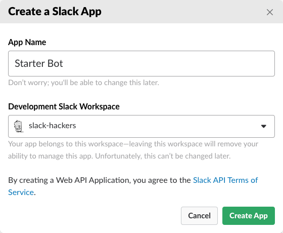
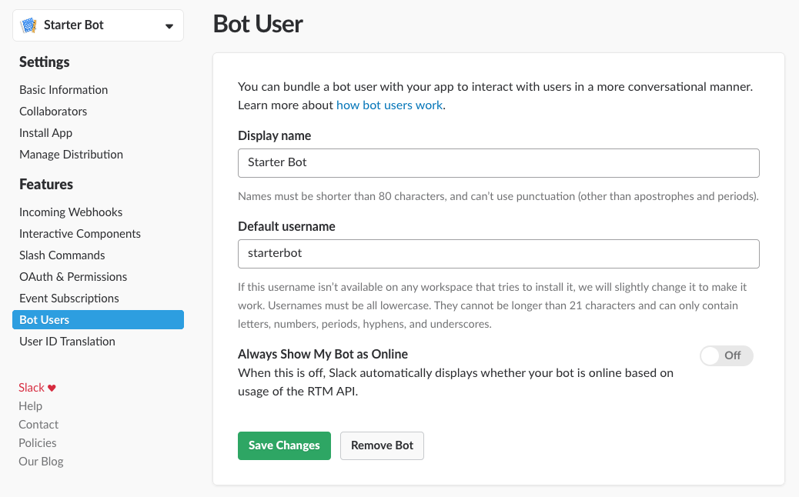
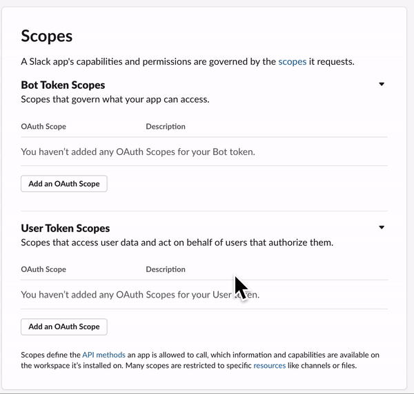
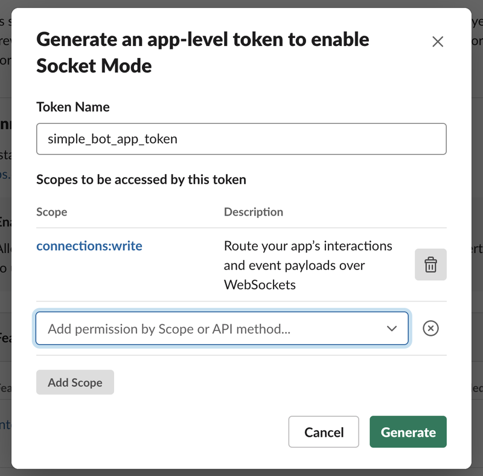
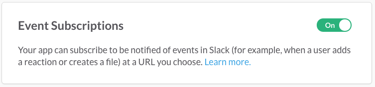
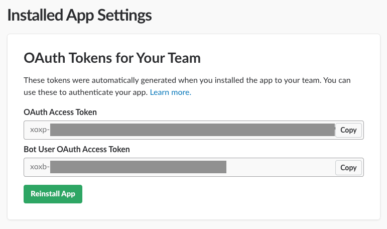

# slack_ai

My local AI system accessible via Slack.

See what it looks like:

Click on the picture to see the video.

## Features & known problems

* Talk to your local LLM via Slack
* Each slack channel corresponds to a conversation.
* All the conversations as well as the system prompts are tracked in a human readable JSON file. Conversations are re-loaded from this file at Bot startup.
* Use slack commends:
  * `/system` Shows & sets the system prompt for the current channel.
* Talks to a PrivateGPT instance that holds your documents.

**⚠️ Beware**
* The system is neither multi-user capable nor meant to deal with a lot of load. The conversations are read & written to a local JSON file in an *optimistic* way.

## How to run the Bot

In order to run this system, you need a local LLM, PrivateGPT, slack_ai and the configuration in Slack. 

### Local LLM
* Get a local LLM running that offers access via an [OpenAI API](https://platform.openai.com/docs/api-reference/chat/create). Option I heard of:
* [LM Studio on my Mac](https://lmstudio.ai) - this is what I use
* [Ollama](https://ollama.com) - nottested yet

### PrivateGPT

Clone the [PrivateGPT](https://github.com/imartinez/privateGPT) repo and folow the installation in the [installation guide](https://docs.privategpt.dev/installation/getting-started/installation). 
### 
* Clone this repo 
* Make sure u have python 3.12 or so
* `pip install -r requirements.txt`
* Create a `.env` file and edit it: `cp sample.env .env`
* Start the thing with `python -m slack_ai.main` and watch the logs scroll 😉

### Configuring the Bot on [slack](https://api.slack.com/apps)

In order to have the slack platform interacting with your bot, you need to configure it. Follow these steps:
* Go to https://api.slack.com/apps
* **Create a new app**
  
* Configure the slackbot: After we have created the bot, we will be redirected to the bot’s configuration page, which looks like this:
  
* **Add scopes**
  Under the “Features” section in the left panel, go to the “OAuth & Permissions” tab. Navigate down to “Bot token scopes” and add the following scopes:
  * app_mentions.read: This allows the bot to read the messages that mention our bot.
  * channels:join: This allows the bot to join channels.
  * chat:write: This allows the bot to send messages in a public channel.
  
* **Enable Socket Mode**
  The next step is to enable Socket Mode. If we weren’t using Socket Mode, we would need to expose a public HTTP endpoint through which the bot would interact within a Slack workspace; this is often not allowed in a corporate firewall. Using Socket Mode allows the Slackbot to use websockets for interaction.
  To enable Socket Mode, click on the “Socket Mode” tab inside the “Settings” section of the left panel. Toggle the “Enable Socket Mode” button. Once the button is toggled, a pop up will appear to generate an app-level token - make sure to keep this token safe as anyone holding it has access to the entire organization’s messages.
  Enter an appropriate name for the token and click on “Generate.” We’ll use the token later on in our Python code.
  
  Click on “Done,” and ensure that Socket Mode is enabled.
* **Enable event subscriptions**
  The next step is to allow event subscriptions. This is an important configuration which will allow the bot to respond automatically to certain events, such as a direct message or mention. Navigate to “Event Subscriptions” under the “Features” section in the left panel and toggle the “Enable Events” switch to turn it on.
  
  Once we do this, the page will display some extra sections. Click on the “Subscribe to the bot events” section to expand it, and then click on “Add Bot User Event.” Choose the “app_mention” event from options to subscribe, and click on “save changes.”
  
  We need the following events:
    * `message.channels` A message was posted to a channel
* Install the Slackbot in a workspace
  At this point, we have our bot configured properly, and it is ready to be installed in our workspace. Under the “Settings” section on the left panel, navigate to the “Install App.”
  The flow to this step will depend on our restrictions and access permissions. If the workspace we’re installing on has restrictions, we will have the option to “Request to install” our app before we can go ahead and install it in that workspace. Otherwise, we can simply install our Slackbot.
  
  Copy this token and save it somewhere; we’ll be using this token as “SLACK_BOT_TOKEN” later in our code. 

# To Do

* Add documents
  * Automatically scrape websites, i.e. getA12
  * Automatically scan & scrape discourse
* Properly document 
  * the inner structure of slack_ai
  * the different APIs used and consumed
* An `/error` command that shows me that last error 
* A `/model` command showing me 
  * what model I use
  * what models are available
  * what model I want to use
* Setup the Slack bot based on a JSON File that describes all the Slack bot options
* Anable DM (Direct Messages) with the Slack bot
* Add document search
  * ~~With PrivateGPT~~
  * Show wich documents were used for creating the answer
  * With references to the "original" document, i.e. a link to the official source of the document.

## Reading / Problems / Solutions

* [Slack Bolt Framework - Listening to events](https://slack.dev/bolt-python/concepts#event-listening)
* [How to Build a Slackbot with Python](https://www.kubiya.ai/resource-post/how-to-build-a-slackbot-with-python)
* Took this [ChatGPT class](https://gist.github.com/joeddav/a11e5cc0850f0e540324177a53b547ae)

