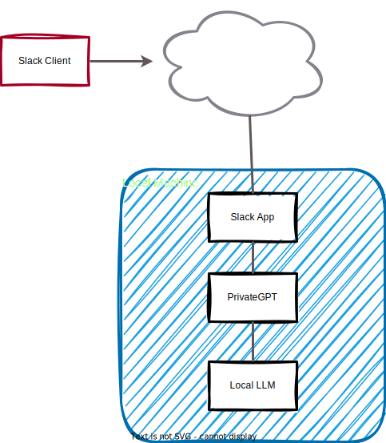

# slack_ai

My local AI system accessible via Slack.

See what it looks like:

Click on the picture to see the video.

## Getting things going

* Get a local LLM running that offers access via an [OpenAI API](https://platform.openai.com/docs/api-reference/chat/create). I used [LM Studio on my Mac](https://lmstudio.ai).
* Clone this repo 
* Make sure u have python 3.12 or so
* `pip install -r requirements.txt`
* Create a `.env` file and edit it: `cp sample.env .env`
* Start the thing with `python app.py` and watch the logs scroll 😉

# To Do

* Describe in the readme how to set up the bot in Slack
* Store messages to file so they are still available after shiutdown & restart
* Make the system message visible & changeable

## Reading / Problems / Solutions

* [Slack Bolt Framework - Listening to events](https://slack.dev/bolt-python/concepts#event-listening)
* [How to Build a Slackbot with Python](https://www.kubiya.ai/resource-post/how-to-build-a-slackbot-with-python)
* Took this [ChatGPT class](https://gist.github.com/joeddav/a11e5cc0850f0e540324177a53b547ae)

